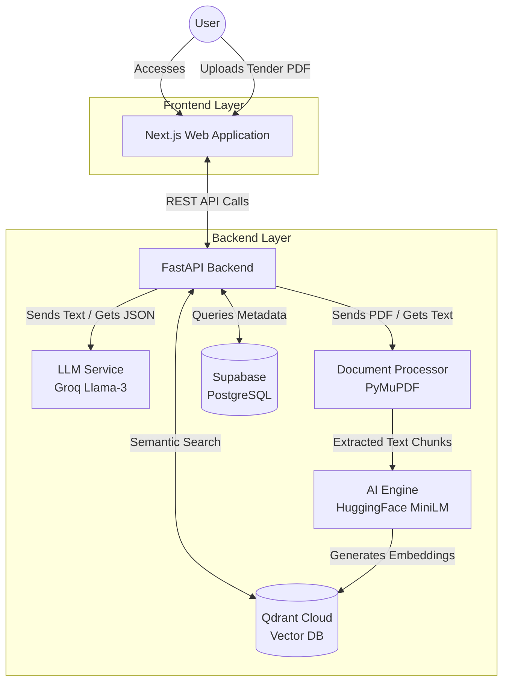

# ManakSetu Architecture

This document outlines the high-level architecture of ManakSetu, our AI-Powered Recommendation Engine for Identifying Applicable Indian Standards.

## System Diagram

## Description of Components

1. **Frontend (Next.js):** The user interface providing search functionality, document upload zones, and standard details.
2. **Backend (FastAPI):** The core API orchestrating all background logic and external connections.
3. **LLM Service (Groq):** Provides high-speed text summarization, conversational interactions, and compliance extraction from documents.
4. **Document Processor:** Extracts clean text from uploaded PDFs/DOCX files.
5. **AI Engine (HuggingFace local model):** Generates 384-dimensional mathematical embeddings from text without requiring external API calls.
6. **Qdrant Vector DB:** Stores and searches the embeddings for extremely fast and accurate semantic matching.
7. **PostgreSQL:** Stores stable relational data, links, and pre-generated AI summaries for Indian Standards.
